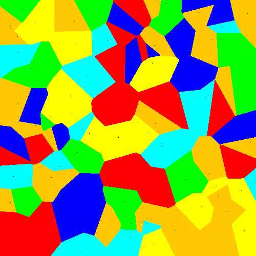
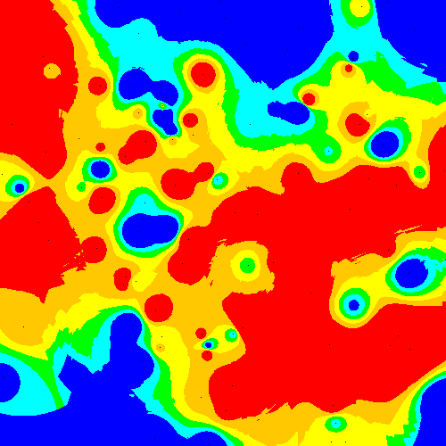

Projet d'implémentation naive de 3 algorithmes d'interpolation
--------------------------------------------------------------

**Diagramme de Voronoi**

Le principe est simple. A partir d'une base de donnée de points, de couleurs donnée, on colorie les autres points 
en les comparant à ceux de la base. Un point donné aura la même couleur que le point (de la base de donnée) le plus proche
(au sens d'une distance quelconque).

**Carte météorologique**

//Description à ajouter

**Marching Squares**

//Description à ajouter

Références:
* (1): http://en.wikipedia.org/wiki/Voronoi_diagram
* (2): http://fr.wikipedia.org/wiki/Carte_m%C3%A9t%C3%A9orologique
